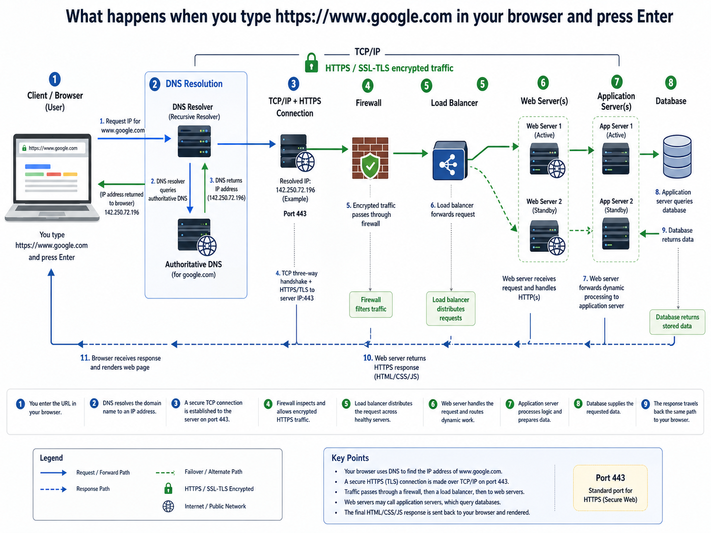

# What Happens When You Type google.com in Your Browser and Press Enter?

## Description

This project contains a technical blog post explaining what happens when a user types `https://www.google.com` in a browser and presses Enter.

The article explains the main infrastructure and networking concepts involved in the request-response cycle, including DNS, TCP/IP, firewalls, HTTPS/SSL, load balancers, web servers, application servers, and databases.

## Diagram

The following diagram illustrates the flow of the request from the browser to the server and back:

## Concepts Covered

* DNS request

* TCP/IP

* Firewall

* HTTPS/SSL

* Load balancer

* Web server

* Application server

* Database

## Blog Post

Blog post link:

https://www.linkedin.com/posts/norah-a-564867274_ugcPost-7476732748582273024-7vx4/?utm_source=share&utm_medium=member_desktop&rcm=ACoAAEML-FwB6cLurgJWF1oHcRQL5ltzmzvv14w 

## Author

Norah Aljuhani
